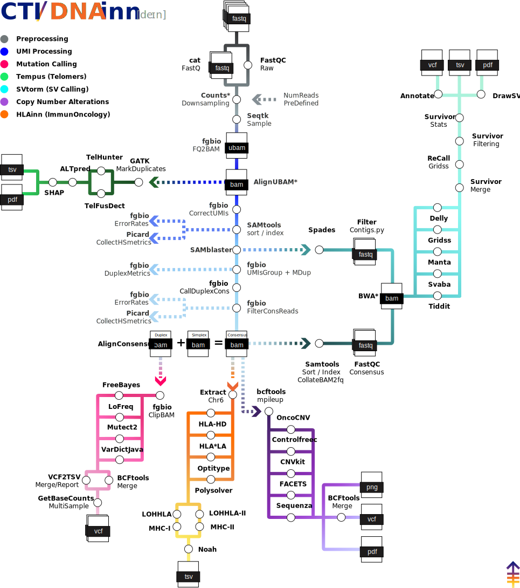

  <picture>
    <source media="(prefers-color-scheme: dark)" srcset="assets/DNAinn_logo_dark.svg">
    
  </picture>

[](https://www.nf-test.com)
[](https://www.nextflow.io/)
[](https://docs.conda.io/en/latest/)
[](https://www.docker.com/)
[](https://sylabs.io/docs/)
[](https://cloud.seqera.io/launch?pipeline=https://github.com/CMOinn/dnainn)

## Introduction

<picture>
  <source media="(prefers-color-scheme: dark)" srcset="assets/DNAinn_metro_dark.svg">
  
</picture>

**DNAinn** is a bioinformatics pipeline for processing DNA sequencing data from the MSKCC panels IMPACT and ACCESS.

## Pipeline Steps

0. DNAinn starts from seq data as FastQ files, in the 


# Structural Variants Calling (SVtorm as stand-alone pipeline)

1. Calling SVs
   - ([`Delly`](https://github.com/dellytools/delly))
   - ([`Svaba`](https://github.com/walaj/svaba))
   - ([`Manta`](https://github.com/Illumina/manta))
   - ([`Gridss`](https://github.com/PapenfussLab/gridss))
2. Merging Calls ([`SURVIVOR`](https://github.com/fritzsedlazeck/SURVIVOR))
3. Bed to Interval list ([`GATK`](https://gatk.broadinstitute.org/hc/en-us/articles/360035531852-Intervals-and-interval-lists))
4. ReCalling ([`Gridss`](https://github.com/PapenfussLab/gridss))
5. Filtering Calls ([`SURVIVOR`](https://github.com/fritzsedlazeck/SURVIVOR))
6. Annotate SVs ([`iAnnotateSV`](https://github.com/mskcc/iAnnotateSV))
7. Draw SVs ([`DrawSV`](https://github.com/jblancoheredia/DrawSV))
8. Check for expected SVs in Controls 
9. Present QC for raw reads ([`MultiQC`](http://multiqc.info/)) 

1. Read QC ([`FastQC`](https://www.bioinformatics.babraham.ac.uk/projects/fastqc/))
2. Present QC for raw reads ([`MultiQC`](http://multiqc.info/))

## Usage

> [!NOTE]
> If you are new to Nextflow and nf-core, please refer to [this page](https://nf-co.re/docs/usage/installation) on how to set-up Nextflow. Make sure to [test your setup](https://nf-co.re/docs/usage/introduction#how-to-run-a-pipeline) with `-profile test` before running the workflow on actual data.

<!-- TODO nf-core: Describe the minimum required steps to execute the pipeline, e.g. how to prepare samplesheets.
     Explain what rows and columns represent. For instance (please edit as appropriate):

First, prepare a samplesheet with your input data that looks as follows:

`samples.csv`:

```csv
sample,fastq_1,fastq_2
CONTROL_REP1,AEG588A1_S1_L002_R1_001.fastq.gz,AEG588A1_S1_L002_R2_001.fastq.gz
```

Each row represents a fastq file (single-end) or a pair of fastq files (paired end).

-->

Now, you can run the pipeline using:

<!-- TODO nf-core: update the following command to include all required parameters for a minimal example -->

```bash
nextflow run CMOinn/dnainn \
   -profile <docker/singularity/.../institute> \
   --input samples.csv \
   --outdir ../03_outs
```

> [!WARNING]
> Please provide pipeline parameters via the CLI or Nextflow `-params-file` option. Custom config files including those provided by the `-c` Nextflow option can be used to provide any configuration _**except for parameters**_;
> see [docs](https://nf-co.re/usage/configuration#custom-configuration-files).

## Credits

SVtorm was originally written by Juan Blanco-Heredia at the Marie-Josée and Henry R. Kravis Center for Molecular Oncology, Technology Innovation Lab, Memorial Sloan Kettering Cancer Center.

Main developer:

- [Juan Blanco-Heredia](blancoj@mskcc.org)

We thank the following people for their extensive assistance in the development of this pipeline:

- [Caryn Hale](halec@mskcc.org)
- [Brian Loomis](loomisb@mskcc.org)
- [Kanika Arora](AroraK@mskcc.org)
- [Shivani Guturu](guturus1@mskcc.org)

## Contributions and Support

If you would like to contribute to this pipeline, please see the [contributing guidelines](.github/CONTRIBUTING.md).

## Citations

An extensive list of references for the tools used by the pipeline can be found in the [`CITATIONS.md`](CITATIONS.md) file.

This pipeline uses code and infrastructure developed and maintained by the [nf-core](https://nf-co.re) community, reused here under the [MIT license](https://github.com/nf-core/tools/blob/main/LICENSE).

> **The nf-core framework for community-curated bioinformatics pipelines.**
>
> Philip Ewels, Alexander Peltzer, Sven Fillinger, Harshil Patel, Johannes Alneberg, Andreas Wilm, Maxime Ulysse Garcia, Paolo Di Tommaso & Sven Nahnsen.
>
> _Nat Biotechnol._ 2020 Feb 13. doi: [10.1038/s41587-020-0439-x](https://dx.doi.org/10.1038/s41587-020-0439-x).